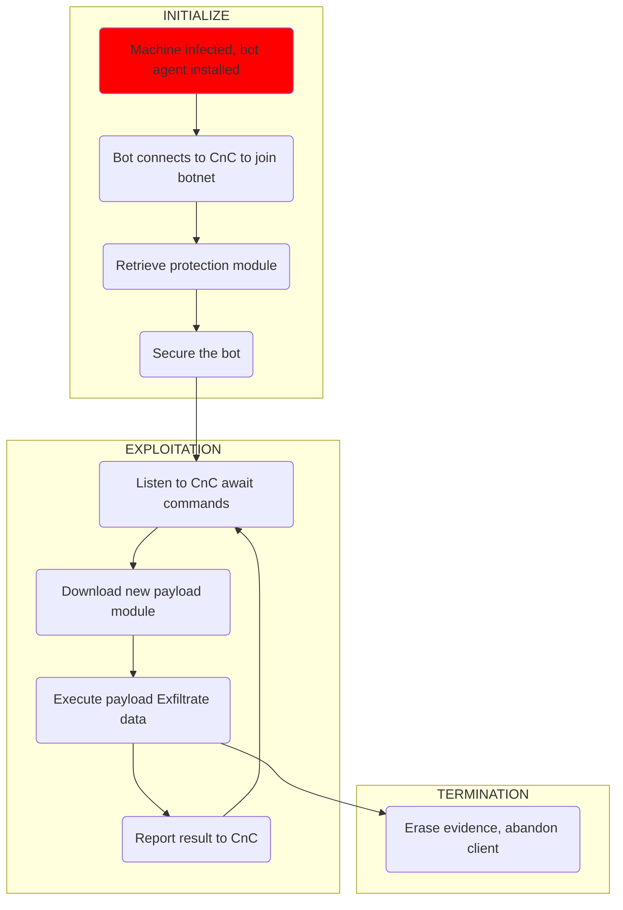

# Botnets and IoT

## Introduction

Your malware has infected 10k targets .. What do you do now?
Spam or DDoS actions are really stupid - noisy behaviour leads to fast detection & neutralisation of the agent.

Better approaches are:

| Persist and avoid detection | Explore target and steal all valuable information.
Load customised exploitation functionality.
Persist to maximise yield (password intercepts, ..). |
| --- | --- |
| Move to active attacks | An increased chance of detection is now justified to further monetise the target → noisier attacks.
Load customised attack functionality. |
| Throw away agent | Sell/rent infected machines to clueless
idiots to maximise profit |

## Botnets

A bot agent is a malware tool installed on compromised machines.

A botnet is the collection of all bot agents controlled by a bot-master, who is the operator/controller of the botnet.

Command&Control is the botnet management and communication system.

This architecture allows efficient, scalable, dynamic, and robust control of millions of machines with low risk of identification of the bot master.

### Challenges

- Send and receive new instructions and malicious capabilities
- Robustly manage 10,000+ globally distributed agents
- Resistant to hijack and shut-down attempts

## CnC Infrastructure Localisation

The ability of a bot agent to locate the CnC infrastructure is a critical requirement for maintaining control of the entire botnet. A bot agent that cannot connect to the control infrastructure cannot be controlled. 

The bot has to somehow identify the CnC infrastructure. The CnC communication can be intercepted by competitors and/or law enforcement to shut down or take over the botnet and Identify the bot master.
For this reason, botnet takedown attempts typically target the CnC infrastructure.

### IP address and Domain Fluxing

A CnC resource with a given Fully Qualified Domain Name (FQDN) is mapped to a new set of IP addresses as often as every few minutes.

The same FQDN connects to a different IP and CnC server every few minutes. IPs of unresponsive CnC nodes are taken out of flux

Availability is always maintained, gives quality of service & robustness.

Domain flux generates list of “rendezvous” points that may be used by the bot masters to control their bots.
Each bot independently computes a list of domain names using a Domain Generation Algorithm (DGA). These domain names are tried to connect to the command and control infrastructure.
The list of domain names is periodically refreshed. Not all generated domains must be valid for the botnet to be operative. Only the bot master knows the sequence of generated domain names.

## Botnet Defence

### Sink-holing

A technique that is used to redirect the traffic from bots to an analysis server.
A sinkhole server gathers analytics and controls bots *(if the authentication is also reverse engineered)*

Reverse engineering of infected machines enables security researchers to replicate the DGA.

This allows the identification and registration of some of the “rendezvous” domains, and thereby
redirect all traffic of infected bots to the sinkhole server.

### ****Instrumentation of bot agents****

An infected machine exposes valuable botnet telemetry data.
Run bot agents in a instrumented and controlled environment. Bot generates domain names, which can be analysed.
Intercept bot configuration files when pushed to bot agent by bot master. 
Botnet configuration files provide a wealth of timely and accurate information on ongoing cyber crime campaigns and the organisations targeted by these campaigns.
The timely analysis of botnet configurations enables to track cyber crime campaigns at the
very source.

## IoT

